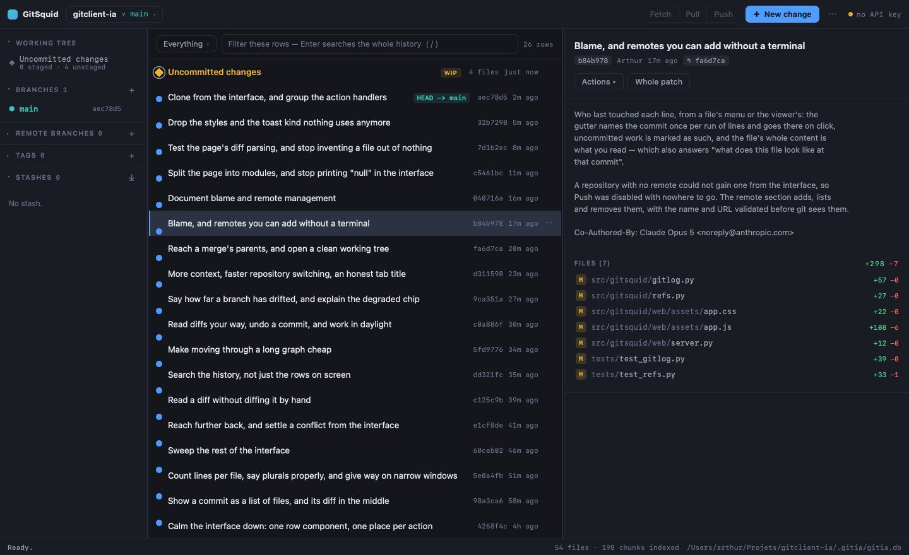
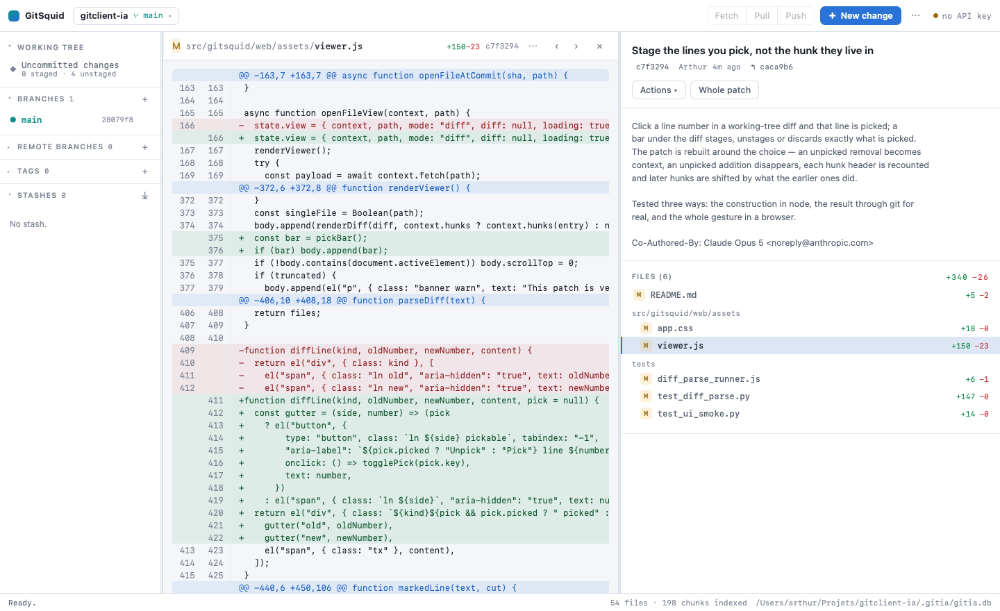

# GitSquid

A repository-local Git client assistant. It indexes one codebase into SQLite, asks one model for
a diff, validates that diff, applies it, runs your tests, and records every step — so you can
always see what changed, why, and whether it passed.

Everything lives inside the repository you point it at. No account, no server, no telemetry.

```
gitsquid ui                                     # the graph interface, on http://127.0.0.1:8756
gitsquid init                                   # create .gitsquid/gitsquid.db
gitsquid index                                  # index this repository
gitsquid run "make period_start timezone-aware" # propose → apply → test → record
gitsquid log                                    # what happened, newest first
gitsquid revert 3                               # undo a change, recorded too
```

---

## Setup

Requires **Python 3.12+** and **git** on `PATH`.

```bash
./scripts/install.sh          # creates .venv and installs gitsquid in editable mode
cp .env.example .env          # then edit .env
source .venv/bin/activate
gitsquid init && gitsquid index
gitsquid doctor                  # config, data location, model availability
```

`ANTHROPIC_API_KEY` in `.env` enables model-generated proposals. Without it the tool still works —
see [Degraded mode](#degraded-mode).

### Scripts

| Script | What it does |
| --- | --- |
| `./scripts/install.sh` | Create `.venv`, install runtime + dev dependencies. |
| `./scripts/dev.sh` | Editable install plus a `gitsquid doctor` smoke check. |
| `./scripts/test.sh` | Run the whole test suite (`pytest`). |
| `./scripts/build.sh` | Build the wheel and sdist into `dist/`. |
| `./scripts/run.sh` | Production-style local run: build, install the wheel into `.venv-prod`, and launch `gitsquid ui` from it. |

---

## The core loop

```
        ┌── index ──┐        ┌── propose ──┐      ┌── apply ──┐     ┌── test ──┐
repo ──▶│  files →  │──────▶ │  retrieval  │────▶ │ validate  │───▶ │ your     │
        │  chunks   │        │  → model    │      │ git apply │     │ command  │
        └───────────┘        └─────────────┘      └───────────┘     └──────────┘
              │                     │                    │                │
              └──────────────── SQLite: files, chunks, changes, test_runs, events ───┘
```

Every step writes to the database. A change moves through `proposed → applied → verified | failed`
and can end at `reverted`; illegal transitions are refused by the model layer, not by the UI.

### Commands

| Command | Purpose |
| --- | --- |
| `gitsquid init` | Create `.gitsquid/gitsquid.db`. |
| `gitsquid index [--force]` | Walk the repository, chunk text files, refresh the FTS5 index. |
| `gitsquid search QUERY` | Show exactly what retrieval would feed a proposal. |
| `gitsquid propose TASK` | Ask for a diff, validate it, record it. Writes nothing to your files. |
| `gitsquid show ID` | Diff, rationale, test runs, and audit trail for one change. |
| `gitsquid apply ID` | Apply a recorded diff to the working tree. |
| `gitsquid test [ID]` | Run `GITSQUID_TEST_COMMAND` and attach the result to a change. |
| `gitsquid revert ID` | Reverse an applied diff. |
| `gitsquid log [--status S]` | List recorded changes. |
| `gitsquid run TASK` | The whole loop in one command. `--revert-on-failure` undoes a red test run. |
| `gitsquid export FILE` / `gitsquid import FILE` | Portable JSON in and out. |
| `gitsquid sample load` / `gitsquid sample clear` | Labelled demo records, and their deletion. |
| `gitsquid doctor` | Configuration, data location, degraded-mode status. |
| `gitsquid ui` | Serve the graph interface on `127.0.0.1`: graph, staging, commit, and the change loop. |

---

## The interface





`gitsquid ui` serves a single page at `http://127.0.0.1:8756/`. No account, no login, no token —
it is a local tool for one person. Three columns, one job each:

- **Left — what the repository holds.** Collapsible sections, remembered between sessions: the
  working tree, local branches with how far each has drifted from its upstream, remote branches,
  tags, stashes. Every entry is the same row, and every row answers a right click — or the ⋯ that
  appears on hover — with what can be done to it.
- **Middle — the graph, or one file.** A WIP node for uncommitted work sits on top, then GitSquid
  changes and git commits on one timeline; the lanes are laid out over the rows actually on screen
  and painted as one drawing, so a branch keeps one colour from tip to root and a merge leaves one
  curve per parent. Click a file anywhere in the interface and the graph gives way to that file's
  diff, full width, with <kbd>↑</kbd> <kbd>↓</kbd> to walk the other files of the same commit and
  <kbd>Esc</kbd> to come back.
- **Right — what is selected.** A commit shows its message, then its files with their status letter
  and the lines each one gained and lost — never the whole patch at once, which is what makes a
  27-file merge readable. A recorded change shows its rationale, its files, its test runs and its
  audit trail. The working tree shows the commit box, with an **Amend** toggle, and the files
  grouped into conflicted, staged and unstaged.

The top bar holds the repository chip — every registered repository, each with its own database,
index, `.env` and history, plus **Clone a repository…** for one you do not have yet — then Fetch,
Pull, Push with their ahead/behind counts, and **New change**. Everything rare lives behind the
**⋯** menu: re-index, export, import, sample records, the repository list, the appearance, the
shortcuts. A right click on Push offers a force push with lease. The page
refreshes itself when you come back to the window, so what your editor did shows up without asking.

**What a right click offers.** On a commit: check it out, branch from it, tag it, cherry-pick it,
revert it, rebase the current branch onto it, reset the branch to it (soft / mixed / hard), copy
its SHA or its message. On a branch: check out, merge or squash merge, rebase onto it, branch from
it, rename, push, delete. On a remote branch: check out as a tracking branch, fetch, delete on the
remote. On a tag: check out, push, delete. On a stash: apply, pop, branch from it, drop. On a file:
stage, unstage, discard, ignore, file history, blame, copy path. On a recorded change: apply, run tests,
revert.

- **Per-hunk staging** — a working-tree diff carries Stage, Unstage and Discard on each hunk.
- **Search** — typing filters the rows on screen; <kbd>Enter</kbd> asks git instead, across every
  branch, by message, author or touched path.
- **Depth** — the graph says how far back it has looked ("80 of 3007 commits loaded") and goes
  further on request.
- **Reading options** — wrap long lines, ignore whitespace, or ask for ten or twenty-five lines of
  context instead of three; each one is remembered.
- **Undo and amend** — the head commit offers both: amend reopens it in the commit box, undo is a
  soft reset onto its parent that brings the work back staged.
- **Appearance** — dark, light, or whatever the system asks for.
- **Interrupted operations** — when a merge, rebase, cherry-pick or revert stops on a conflict, a
  bar names it, counts the files that still conflict, and offers **Continue** (once none do),
  **Skip** for the commit being replayed, or **Abort**. The conflicted files get their own group in
  the panel, and each can be settled by keeping your side or the incoming side whole.
- **File history** — the commits that touched one file, renames followed, from its context menu.
- **Blame** — who last touched each line, from the same menus; a line's commit is one click away.
- **Remotes** — add or remove one from the sidebar, so a repository that starts without a remote
  does not need a terminal to gain one.
- **New change** — task plus an optional diff. Without an API key the diff becomes required, and
  the dialog says so before you submit rather than after.

Both dividers are draggable, keep their width between sessions, and are focusable for keyboard
resizing with <kbd>←</kbd><kbd>→</kbd>.

Keyboard: <kbd>N</kbd> new change · <kbd>W</kbd> uncommitted changes · <kbd>B</kbd> branch ·
<kbd>T</kbd> tag · <kbd>S</kbd> stash · <kbd>R</kbd> refresh · <kbd>I</kbd> re-index ·
<kbd>/</kbd> search · <kbd>↑</kbd><kbd>↓</kbd> or <kbd>j</kbd><kbd>k</kbd> move ·
<kbd>Enter</kbd> focus the detail · <kbd>Shift</kbd>+<kbd>F10</kbd> the menu of the selected row ·
<kbd>Esc</kbd> leave a field, close a menu, or leave a file · <kbd>?</kbd> the full list. Nothing
needs a mouse: every context menu is reachable from the keyboard and walks with the arrow keys.

The server binds `127.0.0.1` only and refuses any request whose `Host` header is not loopback,
which blocks DNS rebinding from a web page you might have open. Nothing outside the machine can
reach it, so there is no credential to manage. The page declares a strict CSP, loads no remote
asset, and the server never logs request contents. `git` runs with `GIT_TERMINAL_PROMPT=0`, so a
remote operation fails with a readable message instead of hanging on a password prompt.

---

## The desktop app

`desktop/` is a Tauri shell: a native window that starts `gitsquid ui` on a free loopback port and
shows it. It needs the `gitsquid` command on the machine — it looks at `$GITSQUID_BIN`, then the
project's `.venv/bin`, then `PATH`.

```bash
cd desktop && npm install
npm run dev                    # the window, against the local engine
npm run build:macos            # .app and .dmg
npm run build:macos:universal  # the same, as a universal binary
npm run build:windows          # .msi and .exe
npm run build:linux            # .deb and .AppImage
```

Each bundle is built by the operating system it targets — Tauri does not cross-compile a desktop
bundle, and running the wrong one tells you so immediately instead of failing inside a Rust build.

---

## Architecture

`src/gitsquid/`, one responsibility per module:

| Module | Responsibility |
| --- | --- |
| `config.py` | Locate the repository root, read `.env`, validate settings. |
| `db.py` | SQLite connection, schema, `PRAGMA user_version` guard. |
| `models.py` | `Change` / `TestRun` / `Event` plus their repositories and the status state machine. |
| `indexer.py` | Walk, filter, chunk, hash; incremental re-indexing. |
| `retrieval.py` | FTS5 search and context assembly under a character budget. |
| `llm.py` | `ProposalBackend` protocol; the Anthropic backend and the patch-file backend. |
| `diffs.py` | Unified-diff parsing, path safety, `git apply` / `--check` / `--reverse`. |
| `runner.py` | Run the verification command, capture and time it. |
| `gitcmd.py` | The one place git is invoked: process, timeouts, credential-prompt refusal, and the validation of every ref, path and commit id that reaches a command line. |
| `gitlog.py` | Reads: commits, parents, branches, remote branches, tags, status, file history, and the operation git stopped in the middle of. |
| `worktree.py` | The working tree and the index: stage, unstage, discard, ignore, per-hunk apply, commit, amend, branch, merge, stash, and the remote sync. |
| `refs.py` | Tags, remote branches, remotes, and branch renaming. |
| `clone.py` | Getting a repository in the first place. |
| `phrasing.py` | How the product counts things, so nothing says "1 file(s)". |
| `history.py` | Check out a commit, branch from it, cherry-pick, revert, reset, rebase — and abort or continue what conflicts. |
| `registry.py` | The list of known repositories, shared by every session. |
| `web/` | Loopback HTTP server and JSON API. The page is seven small scripts, one job each: `base` (elements, text, the API), `menu` (the context-menu component), `menus` (what each row offers), `sidebar`, `viewer` (the middle pane when it shows a file), `panels` (the right column), `actions`, and `app` (state, rows, selection, boot). `graph.js` lays out and paints the lanes. |
| `workflow.py` | `ChangeService` — the core loop, independent of the CLI. |
| `portability.py` | Export and import, with validation of untrusted files. |
| `safety.py` | Redaction, path validation, input cleaning. |
| `ui.py` | Terminal states: empty, loading, validation, success, failure. |
| `cli.py` | Typer commands. Thin: argument handling and presentation only. |

The CLI depends on `ChangeService`; `ChangeService` depends on the `ProposalBackend` protocol, not
on Anthropic. That is what lets the test suite drive the full loop with a stub backend and no
network.

---

## Data location

| What | Where |
| --- | --- |
| Database | `<repo>/.gitsquid/gitsquid.db` (plus `-wal` / `-shm`), one per repository |
| Secrets | `<repo>/.env`, read only by this app, never written to the database |
| Repository list | `~/.config/gitsquid/repos.json` — paths only, override with `GITSQUID_CONFIG_DIR` |
| Exports | Wherever you point `gitsquid export` |

The tool was called gitia before, so a repository indexed then keeps its `.gitia/gitia.db` and is
used as it is; `GITIA_*` variables and `gitia-export` files are still read. Nothing needs
migrating.

`.gitsquid/` contains a `.gitignore` with `*`, so it never lands in a commit. Nothing is written
outside the repository, and nothing leaves the machine except the excerpts sent with a proposal
request when you have an API key configured.

### Backup

The database is a single file. Back it up with a copy while no command is running:

```bash
sqlite3 .gitsquid/gitsquid.db ".backup '/path/to/gitsquid-backup.db'"   # safe while in use
gitsquid export ~/backups/gitsquid-$(date +%F).json                  # portable, human-readable
```

Restore by copying the file back, or with `gitsquid import` — import skips changes already recorded,
so re-importing the same file twice is harmless.

To delete everything GitSquid knows: `rm -rf .gitsquid/`. To delete only the demo rows:
`gitsquid sample clear`.

---

## Permissions

GitSquid asks for nothing it does not need:

- **Read** every file `git ls-files` reports as tracked or untracked-but-not-ignored — your
  `.gitignore` decides what GitSquid sees. Binaries, files over
  `GITSQUID_MAX_FILE_BYTES`, and credential-shaped files (`.env*`, `*.pem`, `*.key`, `id_rsa`,
  `.netrc`, …) are skipped and never indexed or sent.
- **Write** only through git itself — `apply`, `add`, `checkout`, `commit`, `branch`, `tag`,
  `merge`, `rebase`, `cherry-pick`, `revert`, `reset`, `stash`, `push` — only inside the
  repository, and only after you confirm. Every path — in a patch, in a hunk, or from the
  interface — is rejected before it reaches git if it is absolute, contains `..`, or points into
  `.git/` or `.gitsquid/`; every branch, tag and commit id is validated the same way, so nothing from
  the interface is ever interpreted as a git option. Anything destructive — discard, hard reset,
  force push, force delete, dropping a stash — asks first, and lands in the audit trail.
- **Execute** exactly one command — the `GITSQUID_TEST_COMMAND` you configured — in the repository
  directory, with a timeout.
- **Listen** on `127.0.0.1` only while `gitsquid ui` is running, and only for requests whose `Host`
  header is a loopback name.
- **Network** only to `api.anthropic.com`, only during `propose` / `run`, and only when
  `ANTHROPIC_API_KEY` is set.

No analytics, no telemetry, no third-party accounts, no background process.

---

## Degraded mode

Without `ANTHROPIC_API_KEY`, model-generated proposals are unavailable. Nothing else changes:

```bash
gitsquid propose "fix the rounding bug" --patch-file fix.diff
```

Indexing, search, validation, `git apply`, test runs, the audit trail, revert, export, and import
all work identically; the change is recorded with source `patch-file` instead of `model`.
`gitsquid doctor` tells you which mode you are in. This is the only difference — the tool is a
recording and verification harness first, and a model client second.

---

## Accessibility

- Every state prints a text token (`[ok]`, `[fail]`, `[warn]`, `[invalid]`, `[empty]`,
  `[working]`) as well as a colour, so nothing depends on colour perception.
- `NO_COLOR=1` (or `GITSQUID_NO_COLOR=1`) disables colour; `--plain` prints diffs without syntax
  highlighting for screen readers and for piping.
- No mouse, no TUI focus traps: every action is one command. Confirmations are explicit `y/N`
  prompts with a safe default, and `--yes` skips them for scripted use.
- Tables carry header labels; timestamps are ISO-8601 UTC; ids are stable and short.
- Long output is written to stdout and errors to stderr, so `2>/dev/null` and pipes behave.

---

## Security

- Test output and rationales pass through a redactor before they are stored or displayed; API
  keys, tokens, JWTs, and PEM private keys are replaced with `[redacted]`.
- File contents are stored only in the local database, never in logs or the audit trail.
- Imported JSON is treated as untrusted: format, version, types, statuses, and lengths are all
  validated, and diffs are re-validated for path safety before they can be applied.
- Free-text input is length-checked and stripped of control characters; search terms are converted
  into a quoted FTS5 expression rather than interpolated.

---

## Limitations

Stated plainly, because some of them are deliberate:

**Deliberately excluded** (these are what a paid product sells):

- **Frontier coding model quality.** One model call, one shot, no agent loop, no self-repair, no
  multi-file planning. A rejected or wrong patch is your problem to re-prompt.
- **Large-context infrastructure.** Retrieval is BM25 over 80-line chunks with a hard character
  budget (48k by default). No embeddings, no reranking, no whole-repository context.
- **IDE-wide polish and latency.** A terminal CLI. No editor integration, no inline diff review,
  no incremental streaming UI, no background indexing.

**Other limits:**

- One database per repository, and no cross-repository view: you switch between repositories,
  you do not see them side by side. No pull requests, no code review, no issue tracking.
- The interface stages by file or by hunk, commits, amends, branches, tags, merges, squash-merges,
  rebases, cherry-picks, reverts, resets, stashes, fetches, pulls, pushes, and clones. It does
  **not** resolve conflicts in an editor, rebase interactively, or manage submodules, worktrees
  and LFS. A conflict is named and counted, and can be settled by keeping one side whole;
  anything finer is your editor's job, then Continue or Abort from the bar.
- Staging is per file or per hunk, never per line.
- Pull is fast-forward only, on purpose: no implicit merge commit behind your back.
- Credentials are git's business. GitSquid never asks for or stores one, and a remote operation that
  would need an interactive prompt fails with an explanation instead of hanging.
- No blame view, no side-by-side diff, no graph search beyond the loaded window.
- A repository with no commits shows an empty graph — that is the empty state, not an error.
- `git apply` is strict: a diff generated against stale excerpts is refused rather than fuzzed in.
- `revert` reverses the recorded patch. If you edited the same lines afterwards it will refuse,
  and you resolve it with git.
- Sample records describe a fictional `billing/` module and cannot be applied; they exist to show
  the shape of the data.
- Binary files, large files, and credential files are never indexed, so the model cannot reason
  about them.

## Licence

MIT.
